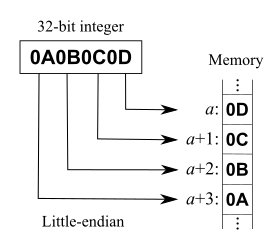

## Binary Encoding

To store data on disk efficiently, it needs to be encoded using a format that is compact
and easy to serialize and deserialize.

## Primitive Types

Keys and values have a type, such as integer, date, or string, and can be represented in their raw binary forms.

Most numeric data types are represented as fixed-size values. When working with
multibyte numeric values, it is important to use the same byte-order (endianness) for
both encoding and decoding.

### [Endianness](https://en.wikipedia.org/wiki/Endianness)
Endianness determines the sequential order of bytes.

Given a value `0x0001`, How do we actually align its two bytes in memory?


European languages conventionally use left-to-right writing system. That can be compared to big-endian, where the most significant digit goes to the left and least significant digits continue to the right: `1234`

Hebrew, Farsi, and Arabic, write words right-to-left. And so is little-endian, where the most significant digit is on the right. `4321`

Example:




## Strings and Variable-Size

Strings and other variable-size data types (such as arrays of fixed-size data) can be
serialized as a number, representing the length of the array or string, followed by size
bytes.

## Bit-Packed Data: Booleans, Enums, and Flags

Booleans can be represented either by using a single byte, or encoding true and
false as 1 and 0 values. Since a boolean has only two values.

### Enum

Enumerated types are used to represent often repeated low-cardinality values. 
For example, We can encode a tree node type using an enum:

```rust
enum NodeType {
    Root,   // 0
    Branch, // 1
    Leaf    // 2
};
```

### Flag

Another closely related concept is flags, kind of a combination of packed booleans
and enums.

Flag values can be read and written from the packed value using [bitmasks](https://en.wikipedia.org/wiki/Mask_(computing)) and bitwise operators. Lets see this [true table](https://en.wikipedia.org/wiki/Truth_table) 


Here gray recrangles represent `0` and greens are `1`.


```rust
let a = 0b_0011; // Bits     : 0  0  1  1
let b = 0b_0101; // We need  :    ^     ^  

println!("Out: {:04b}", a & b); 
```
We can represent bits (`a = 0011`) with prefix `0b`. Here we are using `&` bitmask,


